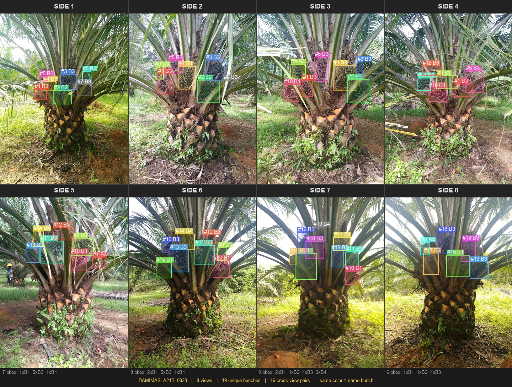

---
annotations_creators:
- expert-generated
language:
- en
size_categories:
- 1K<n<10K
task_categories:
- object-detection
pretty_name: SawitMVC
tags:
- oil-palm
- agriculture
- yolo
- multi-view
- bunch-counting
- maturity-classification
- palm-oil
- computer-vision
- deduplication
- counting
---

# SawitMVC

SawitMVC is a multi-view oil palm fruit bunch detection and counting dataset. It contains expert-reviewed YOLO annotations and per-tree JSON ground truth for counting unique fruit bunches across 4-8 camera views.

## Dataset Summary

| Property | Value |
|---|---|
| Trees | **953** (DAMIMAS: 854, LONSUM: 99) |
| Images | **3,992** (960 x 1280 px, JPEG) |
| Views per tree | 4 sides (45 trees have 8 sides) |
| Annotation format | YOLO v8 labels + JSON ground truth |
| Classes | 4 maturity levels (B1-B4) |
| Unique bunches (GT) | 9,823 |

## Tasks

1. **Object detection**: detect and classify oil palm fruit bunches in each image.
2. **Multi-view counting**: use JSON ground truth to count each physical bunch once even when it appears in multiple camera views.

## Maturity Classes

| Class ID | Label | Stage | Description |
|:---:|:---:|---|---|
| 0 | **B1** | Ripe | Red, large, round; optimal harvest stage |
| 1 | **B2** | Transitioning | Dark fruit transitioning to red |
| 2 | **B3** | Unripe | Black, spiny, elongated |
| 3 | **B4** | Very unripe | Small, deeply positioned, black to green |

Biological order: **B1 -> B2 -> B3 -> B4** from most ripe to least ripe.

## Sample Visualization

Each color represents one unique bunch. The same color across panels means the same physical bunch appears from multiple sides.

**4-view tree:**


**8-view tree:**


## Dataset Structure

```text
SawitMVC/
|-- images/                    # 3,992 images, flat structure
|-- labels/                    # 3,992 YOLO .txt files, flat structure
|-- json/                      # 953 JSON ground-truth files, one per tree
|-- data/
|   `-- ground_truth.parquet   # Per-tree ground-truth summary
|-- data.yaml                  # YOLO dataset config
|-- split_manifest.csv         # Tree-level split and stratification metadata
`-- croissant.json             # ML Croissant metadata
```

## File Naming

```text
DAMIMAS_A21B_0001_1.jpg  -> variety=DAMIMAS, code=A21B, tree=0001, side=1
DAMIMAS_A21B_0001_1.txt  -> YOLO label for the same image
DAMIMAS_A21B_0001.json   -> ground truth for all views of tree 0001
```

## YOLO Label Format

```text
# class_id  cx_norm  cy_norm  w_norm  h_norm
2           0.660417 0.408203 0.056250 0.041406
1           0.622396 0.443750 0.098958 0.087500
```

Coordinates are normalized to `[0, 1]` relative to a 960 x 1280 image. Class IDs are `0=B1`, `1=B2`, `2=B3`, `3=B4`.

## JSON Ground Truth Format

```json
{
  "version": 4,
  "tree_id": "DAMIMAS_A21B_0001",
  "split": "train",
  "metadata": {
    "date": "2026-05-16",
    "variety": "DAMIMAS"
  },
  "images": {
    "side_1": {
      "filename": "DAMIMAS_A21B_0001_1.jpg",
      "side_index": 0,
      "side_label": "Side 1",
      "bbox_count": 5,
      "annotations": [
        {
          "box_index": 0,
          "class_id": 2,
          "class_name": "B3",
          "bbox_yolo": [0.660417, 0.408203, 0.05625, 0.041406]
        }
      ]
    }
  },
  "bunches": [
    {
      "bunch_id": 1,
      "class": "B3",
      "appearance_count": 2,
      "appearances": [
        {"side": "side_1", "side_index": 0, "box_index": 0},
        {"side": "side_2", "side_index": 1, "box_index": 2}
      ]
    }
  ],
  "summary": {
    "total_unique_bunches": 8,
    "total_detections": 17,
    "duplicates_linked": 9,
    "by_class": {"B1": 1, "B2": 2, "B3": 5, "B4": 0},
    "by_side": {"side_1": 5, "side_2": 4, "side_3": 4, "side_4": 4}
  }
}
```

`summary.by_class` is the ground truth for counting evaluation. `_confirmedLinks` stores annotator-confirmed cross-view links using numeric `sideA`, `sideB`, `bboxIdA`, and `bboxIdB` references.

## Parquet Ground Truth

`data/ground_truth.parquet` contains one row per tree.

Columns: `tree_id, split, variety, num_sides, total_unique_bunches, B1, B2, B3, B4, total_detections, duplicates_linked`

Example query:

```sql
SELECT variety, AVG(total_unique_bunches) AS avg_bunches,
       SUM(B1) AS total_B1, SUM(B2) AS total_B2,
       SUM(B3) AS total_B3, SUM(B4) AS total_B4
FROM ground_truth
GROUP BY variety;
```

## Usage

```python
from datasets import load_dataset

ds = load_dataset("ULM-DS-Lab/SawitMVC", data_dir="images")
gt = load_dataset("ULM-DS-Lab/SawitMVC", data_files="data/ground_truth.parquet")
```

```python
import json
from pathlib import Path

tree = json.loads(Path("json/DAMIMAS_A21B_0001.json").read_text(encoding="utf-8-sig"))
gt = tree["summary"]["by_class"]
total = tree["summary"]["total_unique_bunches"]
```

## YOLO Training

```bash
yolo detect train data=data.yaml model=yolov8n.pt epochs=100 imgsz=960
```

## Dataset Collection

- **Source:** Field surveys at DAMIMAS and LONSUM palm oil plantations in Indonesia
- **Capture:** Smartphone cameras, 4-8 positions per tree
- **Annotation:** Expert agronomists using multi-view cross-referencing
- **Resolution:** 960 x 1280 pixels
- **Date:** February 2026

## Citation

```bibtex
@dataset{ulm_sawitmvc_2026,
  title     = {SawitMVC},
  author    = {Fatma Indriani and Setyo Wahyu Saputro and Alia Rahmi and Dwi Kartini and Triando Hamonangan Saragih and Naufal Said and Hartoni},
  year      = {2026},
  publisher = {Hugging Face},
  url       = {https://huggingface.co/datasets/ULM-DS-Lab/SawitMVC}
}
```

## License

This dataset is released under the **Creative Commons Attribution-NonCommercial 4.0 International (CC BY-NC 4.0)** license.

You may share and adapt the dataset for non-commercial purposes with appropriate attribution. Commercial use is not permitted.

