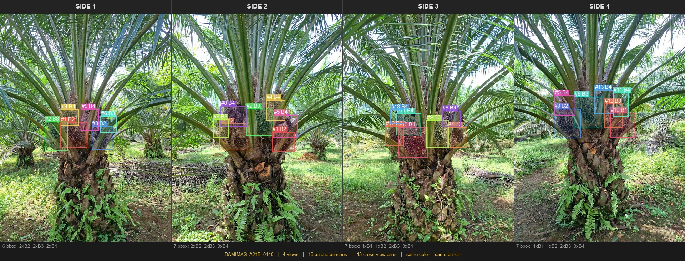

---
annotations_creators:
- expert-generated
language:
- id
size_categories:
- 1K<n<10K
task_categories:
- object-detection
pretty_name: OilPalm MultiView BunchCount
tags:
- oil-palm
- sawit
- agriculture
- yolo
- multi-view
- bunch-counting
- maturity-classification
- palm-oil
- computer-vision
- indonesian
- deduplication
- counting
---

# OilPalm MultiView BunchCount

A multi-view oil palm fruit bunch detection and counting dataset with expert-annotated ground truth for unique bunch deduplication across camera views.

## Dataset Summary

| Property | Value |
|---|---|
| Trees | **953** (DAMIMAS: 854, LONSUM: 99) |
| Images | **3,992** (960 × 1280 px, JPEG) |
| Views per tree | 4 sides (45 trees have 8 sides) |
| Annotation format | YOLO v8 + JSON ground truth |
| Classes | 4 maturity levels (B1–B4) |
| Unique bunches (GT) | 9,823 |


## Task Description

Each oil palm tree is photographed from **4–8 sides**. The core tasks are:

1. **Object Detection** — detect and classify bunches (B1–B4) in each image using YOLO labels
2. **Multi-View Counting** — use JSON ground truth to evaluate unique bunch count per tree per maturity class

## Maturity Classes

| Class ID | Label | Stage | Description |
|:---:|:---:|:---:|---|
| 0 | **B1** | Ripe | Red, large, round; lowest position on bunch; optimal harvest stage |
| 1 | **B2** | Transitioning | Black transitioning to red; large and round; positioned above B1 |
| 2 | **B3** | Unripe | Fully black, spiny, elongated; positioned above B2 |
| 3 | **B4** | Very unripe | Smallest, deepest in bunch, heavily spined, black to green; still developing |

Biological order: **B1 → B2 → B3 → B4** = most ripe to least ripe.

> **Key challenge:** B2 ↔ B3 are visually ambiguous under field conditions. Label noise = 0% (expert-annotated), but inter-class boundary is irreducible.

## Sample Visualization

Each color represents one unique bunch — **same color across panels = same physical bunch seen from different sides**. This cross-view duplication is the core challenge of the dataset.

**4-view tree (standard):**


**8-view tree (dense capture):**


## Dataset Structure

```
OilPalm-MultiView-BunchCount/
├── images/             # 3,992 images (flat) + metadata.jsonl
├── labels/             # 3,992 YOLO .txt files (flat)
├── json/               # 953 JSON ground truth files (1 per tree)
├── data/
│   └── ground_truth.parquet  # GT summary table, queryable via Data Studio
├── data.yaml           # YOLO dataset config
└── croissant.json      # ML Croissant metadata
```

### File Naming Convention

```
DAMIMAS_A21B_0001_1.jpg   →  varietas=DAMIMAS, code=A21B, tree=0001, side=1
DAMIMAS_A21B_0001_1.txt   →  corresponding YOLO label
DAMIMAS_A21B_0001.json    →  GT for all sides of tree 0001
```

## Data Formats

### YOLO Label Format (`labels/*.txt`)

```
# class_id  cx_norm  cy_norm  w_norm  h_norm
2           0.660417 0.408203 0.056250 0.041406
1           0.622396 0.443750 0.098958 0.087500
```

- Coordinates normalized to [0, 1] relative to 960×1280 image
- Class IDs: 0=B1, 1=B2, 2=B3, 3=B4

### JSON Ground Truth Format (`json/*.json`)

```json
{
  "tree_id": "DAMIMAS_A21B_0001",
  "split": "train",
  "images": {
    "sisi_1": {
      "filename": "DAMIMAS_A21B_0001_1.jpg",
      "side_index": 0,
      "bbox_count": 5,
      "annotations": [
        {"box_index": 0, "class_id": 2, "class_name": "B3",
         "bbox_yolo": [0.660, 0.408, 0.056, 0.041]}
      ]
    }
  },
  "bunches": [
    {"bunch_id": 1, "class": "B3", "appearance_count": 2,
     "appearances": [{"side": "sisi_1", "box_index": 0}, {"side": "sisi_3", "box_index": 2}]}
  ],
  "summary": {
    "total_unique_bunches": 8,
    "total_detections": 17,
    "duplicates_linked": 9,
    "by_class": {"B1": 1, "B2": 2, "B3": 5, "B4": 0},
    "by_side": {"sisi_1": 5, "sisi_2": 4, "sisi_3": 4, "sisi_4": 4}
  }
}
```

`summary.by_class` is the **ground truth for counting evaluation**.

> **Note on `split` field:** The `split` value in each JSON file (`"train"`, `"val"`, or `"test"`) reflects the original split assignment by the dataset creators. It is **informational only** — ground truth counts are per-tree and fully independent of any split. Users are free to define their own train/val/test splits by reassigning trees based on `tree_id`.

### Parquet Ground Truth (`data/ground_truth.parquet`)

Queryable via HF Data Studio:

```sql
SELECT varietas, AVG(total_unique_bunches) as avg_bunches,
       SUM(B1) as total_B1, SUM(B2) as total_B2,
       SUM(B3) as total_B3, SUM(B4) as total_B4
FROM ground_truth
GROUP BY varietas
```

Columns: `tree_id, split, varietas, num_sides, total_unique_bunches, B1, B2, B3, B4, total_detections, duplicates_linked`

## Usage

### Load with `datasets` library

```python
from datasets import load_dataset

# Images + metadata (via ImageFolder)
ds = load_dataset("ULM-DS-Lab/OilPalm-MultiView-BunchCount",
                  data_dir="images")
print(ds[0])
# {'image': <PIL Image>, 'tree_id': 'DAMIMAS_A21B_0001', 'side': 1}

# Ground truth (via Parquet)
gt = load_dataset("ULM-DS-Lab/OilPalm-MultiView-BunchCount",
                  data_files="data/ground_truth.parquet")
```

### Load JSON GT manually

```python
import json
from pathlib import Path

tree = json.loads(Path("json/DAMIMAS_A21B_0001.json").read_text())
gt = tree["summary"]["by_class"]   # {"B1": 1, "B2": 2, "B3": 5, "B4": 0}
total = tree["summary"]["total_unique_bunches"]  # 8
```

### YOLO training

```bash
yolo detect train data=data.yaml model=yolov8n.pt epochs=100 imgsz=960
```

## Dataset Collection

- **Source:** Field surveys at DAMIMAS and LONSUM palm oil plantations, Indonesia
- **Capture:** Smartphone cameras, 4–8 positions per tree at ~90° intervals
- **Annotation:** Expert agronomists annotated bunches using multi-view cross-referencing tool
- **Resolution:** 960 × 1280 pixels (portrait orientation)
- **Date:** February 2026

## Citation

```bibtex
@dataset{ulm_oilpalm_multiview_2026,
  title     = {OilPalm MultiView BunchCount},
  author    = {Fatma Indriani and Setyo Wahyu Saputro and Alia Rahmi and Dwi Kartini and Triando Hamonangan Saragih and Naufal Said and Hartoni},
  year      = {2026},
  publisher = {Hugging Face},
  url       = {https://huggingface.co/datasets/ULM-DS-Lab/OilPalm-MultiView-BunchCount}
}
```

## License

This dataset is released under the **Creative Commons Attribution-NonCommercial 4.0 International (CC BY-NC 4.0)** license.

You are free to share and adapt this dataset for non-commercial purposes, provided that appropriate credit is given. Commercial use is not permitted.

[](https://creativecommons.org/licenses/by-nc/4.0/)
