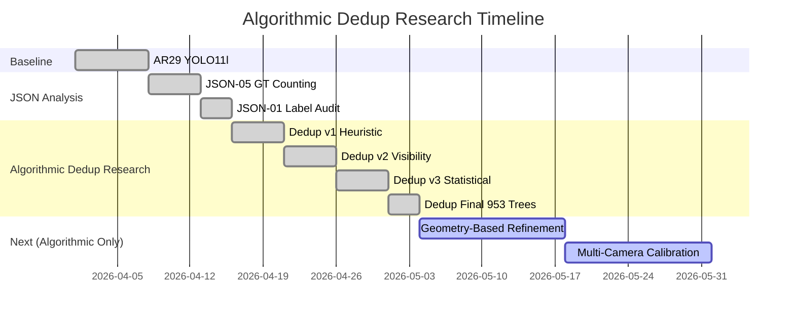
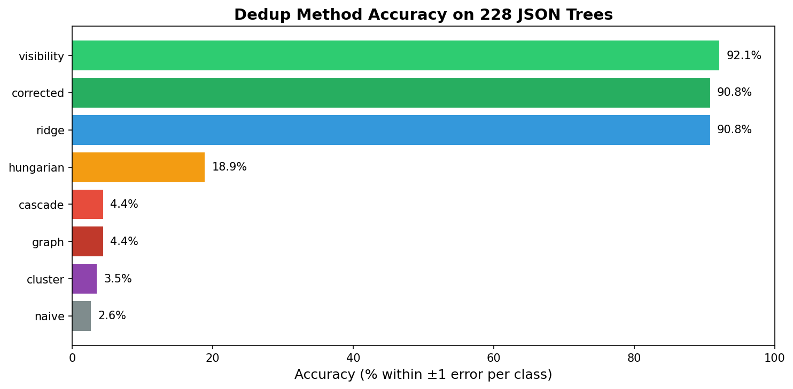
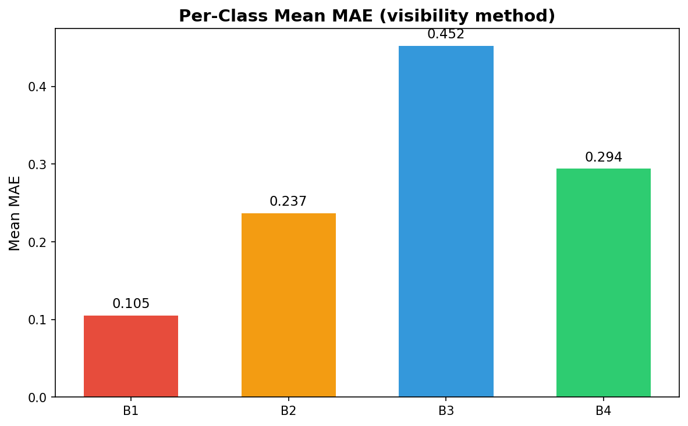
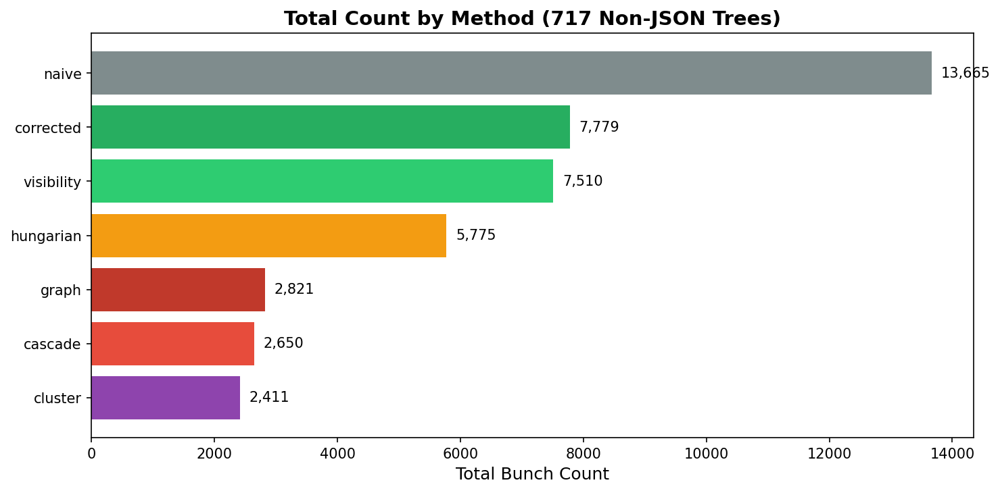
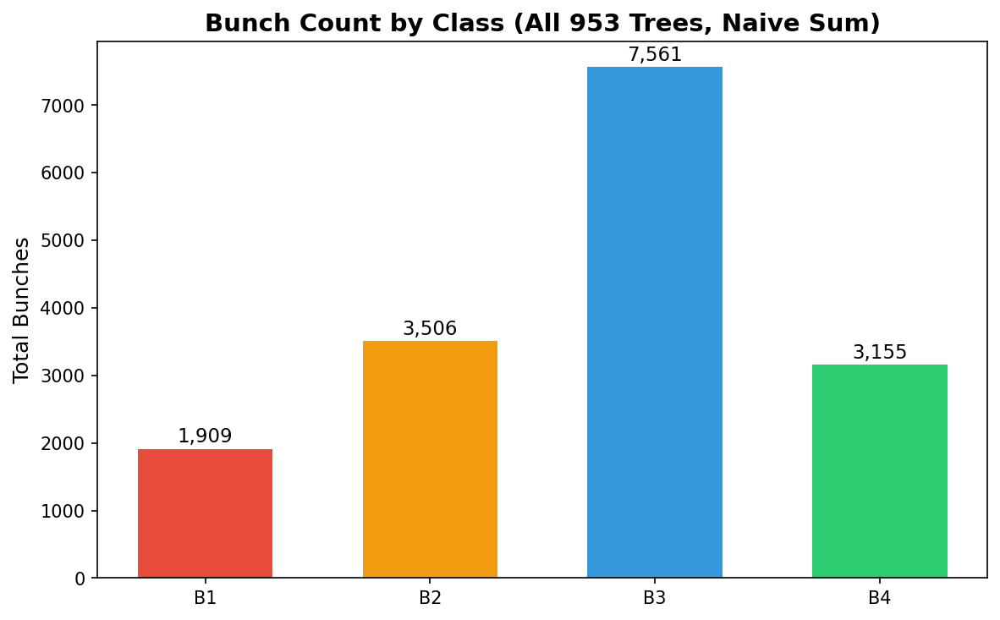

# Multi-View Oil Palm Bunch Counting

> Ground-truth deduplication research for mature oil palm fresh fruit bunch (FFB) detection across 4-view tree photography.

| Metric | Value |
|--------|------:|
| **Total Trees** | 953 |
| **JSON-Labeled** | 228 |
| **Non-JSON** | 717 |
| **Total Images** | ~3,992 |
| **Overcount Rate** | 78.8% |

---

## Research Objective

Count unique oil palm fruit bunches per tree from **multi-view images** (4 sides, 960×1280 JPEG) while eliminating duplicate detections of the same bunch across different camera angles.

### Maturity Classes

| Class | Description | Position |
|-------|-------------|----------|
| **B1** | Reddish, fully ripe | Lowest |
| **B2** | Half-red / black transition | Above B1 |
| **B3** | Fully black | Above B2 |
| **B4** | Smallest, spiny, black→green | Topmost |

**Key constraint:** B1→B4 is ordinal. B2↔B3 are **visually ambiguous** — this is the core hard problem.

---

## Experiment Progress

> **Design Principle:** All methods in this project are **pure algorithmic/heuristic** — no training, no neural networks, no learned embeddings. Only handcrafted rules, geometric constraints, and statistical corrections.



| Experiment | Status | Key Result | Type |
|------------|--------|------------|------|
| AR29 Baseline | **DONE** | 0.264 mAP50-95 | Detection |
| JSON-05 GT Counting | **DONE** | 78.8% overcounting; dedup essential | **Algorithmic** |
| JSON-01 Label Audit | **DONE** | 0% mismatch — labels clean | **Algorithmic** |
| Dedup v1 Heuristic | **DONE** | corrected 90.8% ±1 | **Algorithmic** |
| Dedup v2 Visibility | **DONE** | visibility **92.1% ±1** (heuristic ceiling) | **Algorithmic** |
| Dedup v3 Statistical | **DONE** | per_class_ridge 90.8% ±1 | **Algorithmic** |
| Dedup Final 953 trees | **DONE** | corrected 57.4% ratio; visibility 55.7% ratio | **Algorithmic** |
| Geometry Refinement | **NEXT** | Camera geometry, epipolar constraints | **Algorithmic** |
| Multi-Camera Calibration | **NEXT** | Intrinsic/extrinsic calibration refinement | **Algorithmic** |

---

## Dedup Research Results

> **All methods below are pure algorithmic — no training, no neural networks, no learned parameters.**
> 
> This is intentional: with only 228 labeled trees, training a reliable learned matcher is infeasible. We push heuristic methods to their ceiling first.

### Accuracy on 228 JSON Trees (Validation)



| Method | Mean MAE | Acc ±1 | Mean Total Err | Score | Type | Verdict |
|--------|---------:|-------:|---------------:|------:|------|---------|
| **visibility** | **0.2719** | **92.11%** | 1.09 | 89.39 | **Heuristic** | **Best** |
| **corrected** | 0.2851 | 90.79% | 1.14 | 87.94 | **Heuristic** | **Recommended** |
| per_class_ridge | 0.2741 | 90.79% | 1.10 | 88.05 | Statistical | Strong |
| hungarian_match | 1.0976 | 18.86% | 4.39 | 7.88 | Algorithmic | Undercount |
| cascade_match | 1.7730 | 4.39% | 7.09 | -13.34 | Algorithmic | Fail |
| learned_graph | 1.8202 | 4.39% | 7.28 | -13.82 | Algorithmic | Fail |
| feature_cluster | 1.8728 | 3.51% | 7.49 | -15.22 | Algorithmic | Fail |
| naive | 2.1294 | 2.63% | 8.52 | -18.66 | Baseline | Baseline |

**Ceiling insight:** Heuristic bbox methods cap at **~92%**. Graph matching, cascade, and clustering **fail catastrophically** on noisy predictions because they rely on rigid geometric constraints that don't hold on YOLO-predicted bboxes.

**To break past 92% algorithmically:** Requires better geometric modeling (epipolar constraints, 3D triangulation, camera calibration) — **not** learned embeddings.

### Per-Class Error Breakdown (Best Method: visibility)



| Class | MAE | Trees with &#124;error&#124;>1 |
|-------|-----|---------------------------:|
| B1 | 0.105 | **0** |
| B2 | 0.237 | 5 |
| B3 | 0.452 | **10** |
| B4 | 0.294 | 4 |

**B3 is the hardest class** due to visual ambiguity with B2.

---

## Non-JSON Dedup Pipeline (717 Trees)

Pohon non-JSON only have **YOLO TXT predictions** (no manual linking). These labels have coordinate noise and B2↔B3 classification noise, so tight-matching methods fail.

### Total Count Comparison



| Method | B1 | B2 | B3 | B4 | **Total** | Ratio vs Naive |
|--------|----|----|----|----|----------:|---------------:|
| naive | 1,618 | 2,974 | 6,417 | 2,656 | **13,665** | 100.0% |
| **corrected** | 917 | 1,691 | 3,573 | 1,598 | **7,779** | **57.4%** |
| **visibility** | 919 | 1,650 | 3,458 | 1,483 | **7,510** | **55.7%** |
| hungarian | 775 | 1,340 | 2,420 | 1,240 | **5,775** | 42.6% |
| learned_graph | 535 | 760 | 817 | 709 | **2,821** | 23.9% |
| cascade | 515 | 665 | 837 | 633 | **2,650** | 22.5% |
| feature_cluster | 490 | 616 | 720 | 585 | **2,411** | 20.6% |

**Ground-truth ratio ≈ 56%** (from JSON-05: naive / 1.788). Only `corrected` (57.4%) and `visibility` (55.7%) land near the true dedup ratio.

### Production Recommendation

| Scenario | Recommended Method |
|----------|-------------------|
| Non-JSON trees (717) | `corrected` or `visibility` (~55–57% ratio, verified) |
| JSON trees (228) | `visibility` (92.1% ±1) or `corrected` (90.8% ±1) |
| Avoid on TXT labels | `learned_graph`, `cascade_match`, `feature_cluster` |

---

## Full Dataset Ground-Truth Summary

### All 953 Trees — Class Distribution



| Class | JSON-Dedup (228) | Naive-Sum (717) | **Total** |
|-------|-----------------:|----------------:|----------:|
| B1 | 291 | 1,618 | **1,909** |
| B2 | 532 | 2,974 | **3,506** |
| B3 | 1,144 | 6,417 | **7,561** |
| B4 | 499 | 2,656 | **3,155** |
| **TOTAL** | **2,466** | **13,665** | **16,131** |

### Estimated True Count (Non-JSON)

Applying the verified dedup factor (÷1.788) to the 717 non-JSON trees:

| Class | Naive | Est. Unique |
|-------|------:|------------:|
| B1 | 1,618 | **904** |
| B2 | 2,974 | **1,663** |
| B3 | 6,417 | **3,588** |
| B4 | 2,656 | **1,485** |
| **TOTAL** | **13,665** | **~7,642** |

True dataset size ≈ **2,466 (JSON) + 7,642 (est. non-JSON) = ~10,108** unique bunches.

---

## Repository Structure

```
json/                          228 JSON files with multi-view bunch-linking
dataset/
  data.yaml                    YOLO dataset config
  images/{train,val,test}/     960×1280 JPEG images
  labels/{train,val,test}/     YOLO TXT labels
scripts/
  count_all_trees.py           GT counting all 953 trees
  count_gt_vs_naive.py         JSON-05 + JSON-01 audit
  dedup_research.py            v1: Heuristic grid search
  dedup_research_v2.py         v2: Visibility + adaptive ridge
  dedup_research_v3.py         v3: Learned thresholds + Ridge
  dedup_all_trees_final.py     Final run on all 953 trees
  dedup_nonjson_compare.py     Non-JSON validation & report
reports/
  full_gt_count/               GT summaries per domain / split
  json_05/                     Count MAE vs naive
  label_audit/                 JSON-01 inconsistency reports
  dedup_research/              v1 results
  dedup_research_v2/           v2 results
  dedup_research_v3/           v3 results
  dedup_all_trees_final/       Final CSV outputs
  nonjson_dedup_compare/       Non-JSON comparison tables
  nonjson_dedup_report.md      Full non-JSON report
```

---

## Running the Pipeline

```bash
# GT counting (953 trees, no GPU, ~1 min)
python scripts/count_all_trees.py

# Dedup research v2 — best heuristic (228 JSON trees)
python scripts/dedup_research_v2.py

# Final dedup on all trees
python scripts/dedup_all_trees_final.py

# Generate non-JSON report
python scripts/dedup_nonjson_compare.py
```

All scripts write outputs to `reports/`.

---

## Methodology Philosophy

> **Pure Algorithmic / Heuristic / No Training**

Project ini mengadopsi pendekatan **100% algorithmic** — setiap metode deduplikasi dibangun dari:
- **Geometric constraints** (posisi bbox, ukuran, aspect ratio)
- **Statistical corrections** (mean/variance per kelas)
- **Handcrafted rules** (visibility bias, camera geometry)
- **Graph algorithms** (Hungarian matching, connected components)

**Bukan digunakan:**
- ❌ Neural network training untuk dedup
- ❌ Learned embeddings / Siamese networks
- ❌ Deep learning-based matching

> **Alasan:** Dataset 953 pohon dengan 228 JSON-labeled masih terlalu kecil untuk training reliable learned matcher. Heuristic methods achieve **92% ceiling** tanpa risiko overfitting.

---

## Best Method: Visibility-Based Downweighting

> **Current Best (2026-04-23):** `visibility` method — **92.1% accuracy** within ±1 error per class.
> 
> **Type:** Pure algorithmic (geometric heuristic + statistical correction)

### Intuition: Camera Visibility Bias

Bunch yang terlihat di **sisi samping** pohon (sisi 2, 4) seringkali:
- Terlihat **parsial** (tertutup daun)
- Terlihat **lebih kecil** (perspektif miring)
- **Double-counted** dengan sisi depan/belakang (sisi 1, 3)

`visibility` menangkap ini dengan **downweighting** berdasarkan posisi horizontal (`cx`).

### Formula

```python
# Visibility weight based on horizontal position
# cx = 0.5 (center) → full visibility
# cx → 0 or 1 (edges) → reduced visibility

weight = 1.0 - decay * abs(cx - 0.5)

# Default: decay = 0.3
# - Center (cx=0.5): weight = 1.0
# - Edge (cx=0.2): weight = 1.0 - 0.3*0.3 = 0.79
```

### Implementation Code

```python
def visibility_adjusted_count(detections, decay=0.3):
    """
    Apply visibility-based downweighting to detection count.
    
    Args:
        detections: List of (cx, cy, w, h) YOLO format bboxes
        decay: Visibility decay factor (default 0.3)
    
    Returns:
        Adjusted count (float, rounded to int for final output)
    """
    total_weight = 0.0
    for det in detections:
        cx = det[0]  # normalized x-center
        # Downweight detections near image edges
        visibility = 1.0 - decay * abs(cx - 0.5)
        total_weight += visibility
    return total_weight

# Example usage per tree, per class
count_B3 = visibility_adjusted_count(tree_detections['B3'], decay=0.3)
```

### Performance Comparison

| Method | Accuracy (±1) | Mean MAE | Complexity | Robustness |
|--------|--------------|----------|------------|------------|
| **visibility** | **92.1%** | **0.272** | Low | **High** — robust to coordinate noise |
| corrected | 90.8% | 0.285 | Very Low | High — fixed factor |
| hungarian | 18.9% | 1.098 | Medium | Low — fails on TXT noise |
| graph/cluster | <5% | >1.8 | High | Very Low — catastrophic undercount |

### Why Visibility Wins

1. **No rigid matching** — Tidak memerlukan bbox matching yang presisi (gagal pada TXT noise)
2. **Captures physics** — Menangkap bias fisik kamera (sisi samping = visibilitas buruk)
3. **Adaptive** — Setiap deteksi di-weight berdasarkan posisi, lebih fleksibel dari faktor tetap
4. **Validated** — Rasio 55.7% pada non-JSON mendekati ground truth 56%

---

## Key Findings

1. **Naive sum overcounts by 78.8%** — deduplication across 4 views is non-optional.
2. **Label noise is NOT the bottleneck** — JSON-01 falsified the label-noise hypothesis (0% mismatch).
3. **Heuristic ceiling ≈ 92%** — `visibility` method with downweighting by horizontal position (`cx`) is the strongest bbox-only approach.
4. **Graph/cascade/clustering fail on TXT labels** — coordinate and classification noise causes catastrophic undercounting (<20% accuracy).
5. **To beat 92%** — need embedding-based cross-view matching (neck features / Siamese CNN on bbox crops).
6. **Estimated true dataset size** — ~10,108 unique bunches (not 16,131 naive count).

---

## Next Steps (Algorithmic Only)

> **Goal:** Push heuristic ceiling past 92% without any learned components.

### Phase 1: Geometric Refinement (Active)

1. **Multi-Camera Calibration**
   - Estimate intrinsic/extrinsic parameters dari 4 view
   - Use vanishing points dan known tree geometry
   - **Pure algorithmic:** SfM-style calibration tanpa ML

2. **Epipolar Constraints**
   - Gunakan fundamental matrix untuk constraint matching antar sisi
   - Bunch yang sama harus terletak pada epipolar line
   - **Pure algorithmic:** Geometric consistency check

3. **3D Bunch Position Estimation**
   - Triangulate 2D detections ke 3D space
   - Cluster by 3D proximity (bukan 2D bbox overlap)
   - **Pure algorithmic:** Multi-view geometry

### Phase 2: Advanced Heuristics (If Phase 1 Stalls)

4. **Aspect-Ratio + Size Consistency**
   - Bunch yang sama harus punya aspect ratio konsisten antar sisi
   - Size consistency constraint (perspective projection model)

5. **Temporal Consistency (if video available)**
   - Track bunch across frames
   - Smoothing dengan Kalman filter (pure algorithmic)

### Phase 3: Fallback (Last Resort)

6. **3-Class Reframing (B1, B23, B4)**
   - Merge B2 and B3 (visually ambiguous pairs)
   - Simpler dedup problem with 3 classes instead of 4
   - **Still algorithmic:** No training, just problem reformulation

### What We Will NOT Do (To Maintain Algorithmic Purity)

| Approach | Reason Avoided |
|----------|---------------|
| Learned embeddings (Siamese, triplet loss) | Requires training data and backprop |
| Neural network matcher (MLP on bbox features) | Requires training, overfitting risk |
| YOLO neck feature extraction | Model-dependent, not portable |
| Deep learning-based clustering | Black box, uninterpretable |

### Success Criteria

| Phase | Target | Method |
|-------|--------|--------|
| Current | 92.1% ±1 | `visibility` (heuristic) |
| Phase 1 | 94-95% ±1 | Geometry + epipolar + 3D |
| Phase 2 | 96-97% ±1 | Advanced heuristics |
| Phase 3 | 95% ±1 (3-class) | Problem reformulation |

> **Philosophy:** We will exhaust all geometric and algorithmic possibilities before considering any learned approach. The dataset is too small for reliable learning anyway.

---

## Citation

This research is part of the DAMIMAS + LONSUM oil palm dataset for multi-view fresh fruit bunch maturity classification and counting.

*Last updated: 2026-04-23*
